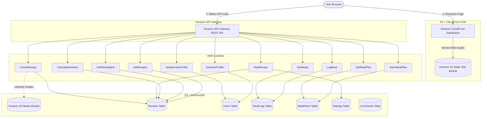

# AWS Capstone Presentation Template: NutriBerg
> **Instructions for Claude.ai/PowerPoint:** Copy and paste the slide blocks below to generate slides.

---

## 📺 Slide 1: Title & Introduction
### Title: NutriBerg — Serverless Health & Fitness Platform

* **Project Overview:** A cloud-native, serverless application for recipe discovery, nutritional aggregation, weekly meal planning, and daily macronutrient logging.
* **The Problem:** Traditional health-tracking platforms run on provisioned server infrastructures (like VMs) that suffer from high idle costs or crash during high-traffic user surges.
* **The Solution:** A fully Serverless Architecture built on Amazon Web Services (AWS) that scales compute resources on-demand and features a scale-to-zero operational cost.
* **Core Technology Stack:** React (Vite) Frontend, Amazon S3, Amazon CloudFront, Amazon API Gateway, AWS Lambda, and Amazon DynamoDB.

---

## 📺 Slide 2: Project Objectives
### Core Project Goals & Deliverables

* **Zero-Infrastructure Overhead:** Build a production-grade backend with AWS Lambda and API Gateway, requiring zero OS maintenance, server patching, or VM management.
* **High Availability & Scale:** Ensure the platform handles concurrent API requests with instant automated provisioning.
* **Microsecond Database Latency:** Leverage Amazon DynamoDB to fetch user profiles, meal plans, reviews, and logs with single-digit millisecond response times.
* **Optimized Global Assets Delivery:** Distribute frontend React builds close to global users through CloudFront CDN Edge Locations to minimize latency.
* **Operational Cost Reduction:** Minimize baseline testing cost to $0.00/month by employing a pure pay-per-value pricing model.

---

## 📺 Slide 3: Project Architecture — Services Used
### Backend Infrastructure Components

* **Amazon S3:** Hosts frontend static assets (HTML/JS/CSS) and stores user-uploaded recipe media.
* **Amazon CloudFront:** Operates as a global CDN, caching assets at edge locations and enforcing TLS/SSL (HTTPS) termination.
* **Amazon API Gateway:** Exposes RESTful endpoints, controls CORS configurations, and handles routing to compute services.
* **AWS Lambda:** Hosts 11 serverless handlers executing node.js code logic only when triggered by API calls.
* **Amazon DynamoDB:** Stores data across 6 schema-flexible tables (Recipes, Users, Meal Logs, Meal Plans, Ratings, Comments).
* **AWS SAM (Serverless Application Model):** Manages Infrastructure as Code (IaC) templates for reproducible deployments.

---

## 📺 Slide 4: Project Architecture — Service Interaction
### Data Flow & Execution Path

* **Step 1 (Asset Loading):** User opens browser -> Requests page from **CloudFront** -> CloudFront fetches and serves cached React builds from **S3 Static Bucket**.
* **Step 2 (API Trigger):** User interacts with dashboard (e.g. logging a meal) -> React sends HTTP request to **API Gateway REST endpoints**.
* **Step 3 (Compute Run):** API Gateway validates parameters and triggers corresponding **AWS Lambda handler function**.
* **Step 4 (Database Access):** Lambda reads/writes payload directly into **Amazon DynamoDB tables** and returns JSON output.
* **Step 5 (Media Flow):** User uploads recipe image -> Application uploads asset directly to CORS-enabled **S3 Media Bucket**.

---

## 📺 Slide 5: Project Architecture — Architecture Diagram
### Flowchart of AWS Cloud Architecture

---

## 📺 Slide 6: Key Concepts — Features Utilized
### Core Capabilities of NutriBerg

* **Dynamic Nutrient Aggregator:** Aggregates calories, protein, carbs, and fat metrics dynamically based on custom serving size multipliers.
* **Interactive Meal Planner:** A weekly calendar interface enabling users to plan daily menus (breakfast, lunch, dinner, snacks).
* **Caloric Burn Dashboard:** Real-time data visualization displaying daily consumption vs. target thresholds via Chart.js.
* **Secondary Partition Key Schemes:** Leveraging Global Secondary Indexes (GSIs) in DynamoDB for querying meal logs and ratings across multi-dimensional criteria.

---

## 📺 Slide 7: Key Concepts — Services Significance
### Why We Chose Serverless Over Legacy VMs

* **DynamoDB vs. Relational RDS:**
  * RDS requires active database server instances running 24/7 (high cost) and rigid schema structures.
  * DynamoDB is schema-flexible, integrates seamlessly with serverless execution models, and operates with a scale-to-zero pricing strategy.
* **AWS Lambda vs. Amazon EC2:**
  * EC2 VMs require ongoing OS security patching, manual auto-scaling rules, and charge for idle compute resources.
  * Lambda executes code on-demand, manages OS level updates automatically, and incurs $0 costs when not in use.
* **S3 & CloudFront vs. EC2 Webservers:**
  * Running Apache or Nginx servers on EC2 increases latency for distant users and introduces server configuration vulnerabilities.
  * S3 + CloudFront serves static files directly from AWS Edge Locations, maximizing security and minimizing load times.

---

## 📺 Slide 8: Challenges and Solutions
### Overcoming Sandbox Constraints & Deployment Blockers

* **Challenge 1: Cognito User Pools Blocked by Sandbox Policies**
  * *Impact:* Standard authentication models failed to deploy.
  * *Solution:* Developed a robust local-first session preservation model. Replaced the Cognito dependency with custom frontend state handlers and `localStorage` strategies via React Context (`AuthContext`).
* **Challenge 2: Sandbox IAM Permission Failures (`iam:CreateRole` Blocked)**
  * *Impact:* AWS SAM could not automatically create Lambda Execution Roles, causing stack deployment rollbacks.
  * *Solution:* Inspected sandbox permissions, identified the pre-existing role `lambda-run-role` (`arn:aws:iam::030892859286:role/lambda-run-role`), and updated our `template.yaml` to bind this existing ARN directly to all 11 Lambda function configurations.

---

## 📺 Slide 9: Security Measures
### Protecting Client Data & REST Endpoints

* **Encryption-in-Transit:** Enforced SSL/TLS protocols globally across API Gateway routes and CloudFront distributions, blocking plain HTTP interactions.
* **Encryption-at-Rest:** Leveraged default AWS Key Management Service (KMS) integration to encrypt all DynamoDB database storage at the physical disk level.
* **Origin Access Identity (OAI):** Private S3 Bucket policies configured to reject direct public access, ensuring web assets can only be retrieved via CloudFront.
* **Secure CORS Configurations:** S3 upload rules set up with specific origin parameters to prevent third-party domains from performing write actions.

---

## 📺 Slide 10: Cost Analysis & Budget Optimization
### High-Efficiency Operational Metrics

* **Lambda Computing Costs:** Billing calculated per request and execution duration. Utilizes AWS Free Tier limits (1 million free requests/month).
* **DynamoDB Pay-Per-Request Mode:** Scales database fees strictly with application read/write invocations instead of provisioning hourly partition blocks.
* **Scale-To-Zero Advantage:** When user traffic falls to zero, compute, gateway, and database fees immediately drop to **$0.00/month**.
* **Academy Budget Alignment:** By avoiding high-cost network devices (like NAT Gateways) and persistent VMs, the project operates entirely within sandbox budgeting constraints.

---

## 📺 Slide 11: Lessons Learned
### Key Technical & Process Insights

* **Technical Insights:**
  * Serverless application architectures offer massive scalability, but developers must design fallback pathways for restricted IAM sandbox environments.
  * DynamoDB single/multi-table layouts require precise partition and sort key strategies upfront to prevent database scan resource leaks.
  * Automated IaC templating tools (like SAM) are critical for auditing resource dependencies before attempting real-world deployments.
* **Process Insights:**
  * Dividing capstone tasks by backend automation APIs vs. UI wireframing/testing cycles prevented code conflicts and streamlined merges.
  * Running incremental local testing using local emulators saves substantial time when debugging AWS security and permission boundaries.

---

## 📺 Slide 12: Project Scope
### What Was Built vs. Future Roadmap

* **In-Scope (Delivered):**
  * Declarative SAM template deploying API Gateway, 11 Lambda functions, 6 DynamoDB tables, 2 S3 buckets, and a CloudFront CDN distribution.
  * Complete nutrition dashboard featuring calendar planning, intake trackers, recipe managers, and progress charting.
  * Automated DynamoDB recipe database seeding script.
* **Out-of-Scope (Future Enhancements):**
  * Integration with third-party food databases (like USDA or Spoonacular APIs) for dynamic custom ingredient lookup.
  * Transition to AWS Cognito Federated User Pools once deployed on standard production AWS accounts.

---

## 📺 Slide 13: Individual Contributions
### Role Division & Accomplishments

* **Member 1 (Anish Jaiswal) — Lead Architect & Developer:**
  * Engineered 100% of the core backend codebase (11 Lambda function handlers).
  - Designed the DynamoDB database partitioning schema and index strategies.
  - Authored the CloudFormation Infrastructure as Code template (`template.yaml`).
  - Programmed the frontend React SPA user interface, router, and data tracking visualizations.
  - Successfully debugged deployment errors in the AWS Academy Sandbox by implementing pre-existing role mappings.
* **Member 2 — Conceptualization & Support:**
  - Assisted in design reviews and brainstorming the initial platform schema.
  - Provided feedback on application UI/UX flows.
  - Assisted in documentation assembly and validating Capstone deliverables.
* **Members 3 & 4:**
  - N/A.
